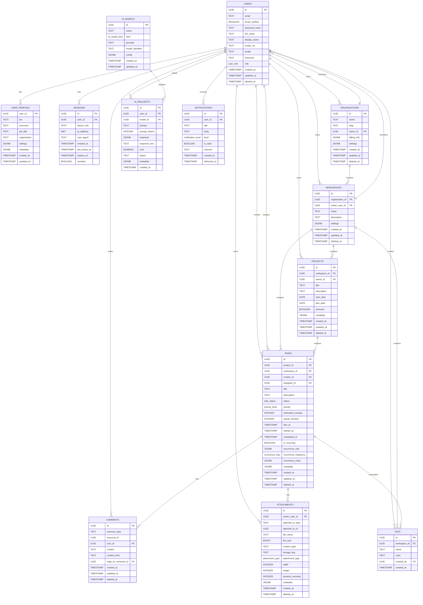

# E-R图

## 数据库实体关系图

```mermaid
erDiagram
    %% 实体定义
    USERS {
        UUID id PK
        TEXT email
        BOOLEAN email_verified
        TEXT password_hash
        TEXT full_name
        TEXT display_name
        TEXT avatar_url
        TEXT locale
        TEXT timezone
        user_role role
        TIMESTAMP created_at
        TIMESTAMP updated_at
        TIMESTAMP deleted_at
    }
    
    USER_PROFILES {
        UUID user_id PK
        TEXT bio
        TEXT pronouns
        TEXT job_title
        TEXT organization
        JSONB settings
        JSONB metadata
        TIMESTAMP created_at
        TIMESTAMP updated_at
    }
    
    SESSIONS {
        UUID id PK
        UUID user_id FK
        TEXT device_info
        INET ip_address
        TEXT user_agent
        TIMESTAMP created_at
        TIMESTAMP last_active_at
        TIMESTAMP expires_at
        BOOLEAN revoked
    }
    
    ORGANIZATIONS {
        UUID id PK
        TEXT name
        TEXT slug
        UUID owner_id FK
        JSONB billing_info
        JSONB settings
        TIMESTAMP created_at
        TIMESTAMP updated_at
        TIMESTAMP deleted_at
    }
    
    WORKSPACES {
        UUID id PK
        UUID organization_id FK
        UUID owner_user_id FK
        TEXT name
        TEXT description
        JSONB settings
        TIMESTAMP created_at
        TIMESTAMP updated_at
        TIMESTAMP deleted_at
    }
    
    PROJECTS {
        UUID id PK
        UUID workspace_id FK
        UUID owner_id FK
        TEXT title
        TEXT description
        DATE start_date
        DATE due_date
        BOOLEAN archived
        JSONB metadata
        TIMESTAMP created_at
        TIMESTAMP updated_at
        TIMESTAMP deleted_at
    }
    
    TASKS {
        UUID id PK
        UUID project_id FK
        UUID workspace_id FK
        UUID creator_id FK
        UUID assignee_id FK
        TEXT title
        TEXT description
        task_status status
        priority_level priority
        INTEGER estimated_minutes
        INTEGER actual_minutes
        TIMESTAMP due_at
        TIMESTAMP started_at
        TIMESTAMP completed_at
        BOOLEAN is_recurring
        JSONB recurrence_rule
        recurrence_freq recurrence_frequency
        JSONB recurrence_meta
        JSONB metadata
        TIMESTAMP created_at
        TIMESTAMP updated_at
        TIMESTAMP deleted_at
    }
    
    TAGS {
        UUID id PK
        UUID workspace_id FK
        TEXT name
        TEXT color
        UUID created_by FK
        TIMESTAMP created_at
    }
    
    COMMENTS {
        UUID id PK
        TEXT resource_type
        UUID resource_id
        UUID user_id FK
        TEXT content
        TEXT content_html
        UUID reply_to_comment_id FK
        TIMESTAMP created_at
        TIMESTAMP updated_at
        TIMESTAMP deleted_at
    }
    
    ATTACHMENTS {
        UUID id PK
        UUID owner_user_id FK
        TEXT attached_to_type
        UUID attached_to_id
        TEXT file_name
        BIGINT file_size
        TEXT content_type
        TEXT storage_key
        attachment_type attachment_type
        INTEGER width
        INTEGER height
        INTEGER duration_seconds
        JSONB metadata
        TIMESTAMP created_at
        TIMESTAMP deleted_at
    }
    
    AI_MODELS {
        UUID id PK
        TEXT name
        ai_model_kind kind
        TEXT provider
        TEXT model_identifier
        JSONB config
        TIMESTAMP created_at
        TIMESTAMP updated_at
    }
    
    AI_REQUESTS {
        UUID id PK
        UUID user_id FK
        UUID model_id FK
        TEXT prompt
        INTEGER prompt_tokens
        JSONB response
        TEXT response_text
        NUMERIC cost
        TEXT status
        JSONB metadata
        TIMESTAMP created_at
    }
    
    NOTIFICATIONS {
        UUID id PK
        UUID user_id FK
        TEXT title
        TEXT body
        notification_level level
        BOOLEAN is_read
        TEXT channel
        TIMESTAMP created_at
        TIMESTAMP delivered_at
    }
    
    %% 关系定义
    USERS ||--o{ USER_PROFILES : has
    USERS ||--o{ SESSIONS : has
    USERS ||--o{ ORGANIZATIONS : owns
    USERS ||--o{ WORKSPACES : owns
    USERS ||--o{ PROJECTS : owns
    USERS ||--o{ TASKS : creates
    USERS ||--o{ TASKS : assigns
    USERS ||--o{ TAGS : creates
    USERS ||--o{ COMMENTS : writes
    USERS ||--o{ ATTACHMENTS : owns
    USERS ||--o{ AI_REQUESTS : makes
    USERS ||--o{ NOTIFICATIONS : receives
    
    ORGANIZATIONS ||--o{ WORKSPACES : contains
    ORGANIZATIONS ||--o{ USERS : members
    
    WORKSPACES ||--o{ PROJECTS : contains
    WORKSPACES ||--o{ TASKS : contains
    WORKSPACES ||--o{ TAGS : contains
    WORKSPACES ||--o{ USERS : members
    
    PROJECTS ||--o{ TASKS : contains
    
    TASKS ||--o{ COMMENTS : has
    TASKS ||--o{ ATTACHMENTS : has
    TASKS ||--o{ TAGS : associated
    
    AI_MODELS ||--o{ AI_REQUESTS : handles
```