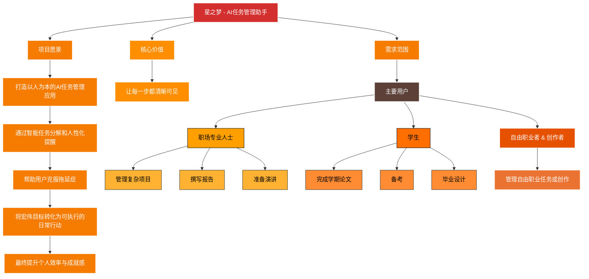

# 总需求图

## 项目总图

```mermaid
graph TD
    A[星之梦 - AI任务管理助手] --> B[项目愿景]
    A --> C[核心价值]
    A --> D[需求范围]

    B --> B1[打造以人为本的AI任务管理应用]
    B1 --> B2[通过智能任务分解和人性化提醒]
    B2 --> B3[帮助用户克服拖延症]
    B3 --> B4[将宏伟目标转化为可执行的日常行动]
    B4 --> B5[最终提升个人效率与成就感]

    C --> C1[让每一步都清晰可见]

    D --> D1[主要用户]
    D1 --> D1a[职场专业人士]
    D1 --> D1b[学生]
    D1 --> D1c[自由职业者 & 创作者]
    
    D1a --> D1a1[管理复杂项目]
    D1a --> D1a2[撰写报告]
    D1a --> D1a3[准备演讲]
    
    D1b --> D1b1[完成学期论文]
    D1b --> D1b2[备考]
    D1b --> D1b3[毕业设计]
    
    D1c --> D1c1[管理自由职业任务或创作]

    %% ---- ---- ---- 上色 ---- ---- ----

    %% 主节点
    style A fill:#D32F2F,stroke:#FFFFFF,stroke-width:2px,color:#FFFFFF

    %% 项目相关
    style B fill:#F57C00,stroke:#FFFFFF,stroke-width:2px,color:#FFFFFF
    style C fill:#FF8F00,stroke:#FFFFFF,stroke-width:2px,color:#FFFFFF

    %% 用户相关
    style D fill:#F57C00,stroke:#FFFFFF,stroke-width:2px,color:#FFFFFF
    style D1 fill:#5D4037,stroke:#FFFFFF,stroke-width:2px,color:#FFFFFF

    style D1a fill:#FFA000,stroke:#000000,stroke-width:1px,color:#000000
    style D1b fill:#FF6F00,stroke:#000000,stroke-width:1px,color:#000000
    style D1c fill:#E65100,stroke:#FFFFFF,stroke-width:1px,color:#FFFFFF

    %% D1a系列
    style D1a1 fill:#FFA000,stroke:#000000,stroke-width:1px,opacity:0.8,color:#000000
    style D1a2 fill:#FFA000,stroke:#000000,stroke-width:1px,opacity:0.8,color:#000000
    style D1a3 fill:#FFA000,stroke:#000000,stroke-width:1px,opacity:0.8,color:#000000

    %% D1b系列
    style D1b1 fill:#FF6F00,stroke:#000000,stroke-width:1px,opacity:0.8,color:#000000
    style D1b2 fill:#FF6F00,stroke:#000000,stroke-width:1px,opacity:0.8,color:#000000
    style D1b3 fill:#FF6F00,stroke:#000000,stroke-width:1px,opacity:0.8,color:#000000

    %% D1c系列
    style D1c1 fill:#E65100,stroke:#FFFFFF,stroke-width:1px,opacity:0.8,color:#FFFFFF

    %% 细节任务节点可以保持默认，或者轻微浅色
    style B1 fill:#F57C00,stroke:#FFFFFF,stroke-width:1px,color:#FFFFFF
    style B2 fill:#F57C00,stroke:#FFFFFF,stroke-width:1px,color:#FFFFFF
    style B3 fill:#F57C00,stroke:#FFFFFF,stroke-width:1px,color:#FFFFFF
    style B4 fill:#F57C00,stroke:#FFFFFF,stroke-width:1px,color:#FFFFFF
    style B5 fill:#F57C00,stroke:#FFFFFF,stroke-width:1px,color:#FFFFFF
    style C1 fill:#FF8F00,stroke:#FFFFFF,stroke-width:1px,color:#FFFFFF
```