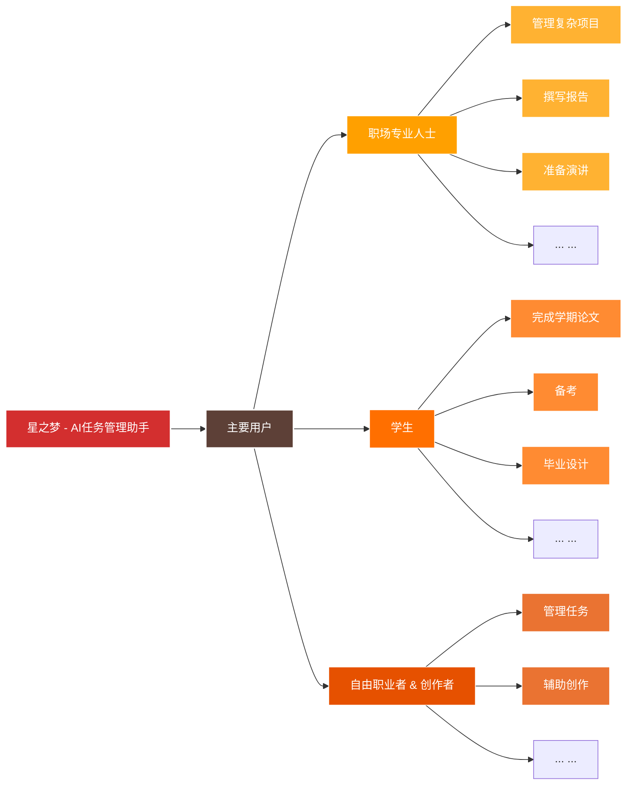

# 总需求图

## 项目总图

```mermaid
graph LR
    A[星之梦 - AI任务管理助手] --> D1[主要用户]

    D1 --> D1a[职场专业人士]
    D1 --> D1b[学生]
    D1 --> D1c[自由职业者 & 创作者]
    
    D1a --> D1a1[管理复杂项目]
    D1a --> D1a2[撰写报告]
    D1a --> D1a3[准备演讲]
    D1a --> D1a4[... ...]
    
    D1b --> D1b1[完成学期论文]
    D1b --> D1b2[备考]
    D1b --> D1b3[毕业设计]
    D1b --> D1b4[... ...]
    
    D1c --> D1c1[管理任务]
    D1c --> D1c2[辅助创作]
    D1c --> D1c3[... ...]

    %% ---- ---- ---- 上色 ---- ---- ----

    %% 主节点
    style A fill:#D32F2F,stroke:#FFFFFF,stroke-width:2px,color:#FFFFFF

    %% 用户相关
    style D1 fill:#5D4037,stroke:#FFFFFF,stroke-width:2px,color:#FFFFFF

    style D1a fill:#FFA000,stroke:#FFFFFF,stroke-width:1px,color:#FFFFFF
    style D1b fill:#FF6F00,stroke:#FFFFFF,stroke-width:1px,color:#FFFFFF
    style D1c fill:#E65100,stroke:#FFFFFF,stroke-width:1px,color:#FFFFFF

    %% D1a系列
    style D1a1 fill:#FFA000,stroke:#FFFFFF,stroke-width:1px,opacity:0.8,color:#FFFFFF
    style D1a2 fill:#FFA000,stroke:#FFFFFF,stroke-width:1px,opacity:0.8,color:#FFFFFF
    style D1a3 fill:#FFA000,stroke:#FFFFFF,stroke-width:1px,opacity:0.8,color:#FFFFFF

    %% D1b系列
    style D1b1 fill:#FF6F00,stroke:#FFFFFF,stroke-width:1px,opacity:0.8,color:#FFFFFF
    style D1b2 fill:#FF6F00,stroke:#FFFFFF,stroke-width:1px,opacity:0.8,color:#FFFFFF
    style D1b3 fill:#FF6F00,stroke:#FFFFFF,stroke-width:1px,opacity:0.8,color:#FFFFFF

    %% D1c系列
    style D1c1 fill:#E65100,stroke:#FFFFFF,stroke-width:1px,opacity:0.8,color:#FFFFFF
    style D1c2 fill:#E65100,stroke:#FFFFFF,stroke-width:1px,opacity:0.8,color:#FFFFFF


```