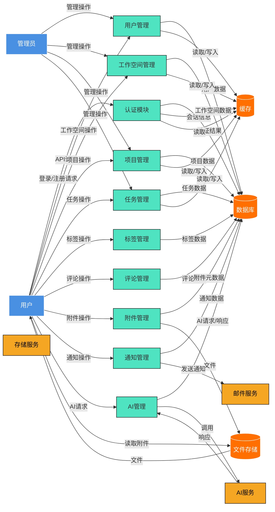

# 数据流图

## 系统数据流图

```mermaid
graph LR
    %% 外部实体
    User[用户]
    Admin[管理员]
    AI[AI服务]
    Email[邮件服务]
    Storage[存储服务]
    
    %% 系统主要处理模块
    Auth[认证模块]
    UserMgmt[用户管理]
    WorkspaceMgmt[工作空间管理]
    ProjectMgmt[项目管理]
    TaskMgmt[任务管理]
    TagMgmt[标签管理]
    CommentMgmt[评论管理]
    AttachmentMgmt[附件管理]
    NotificationMgmt[通知管理]
    AIMgmt[AI管理]
    
    %% 数据存储
    DB[(数据库)]
    FileStorage[(文件存储)]
    Cache[(缓存)]
    
    %% 数据流
    User -->|登录/注册请求| Auth
    Auth -->|验证结果| DB
    Auth -->|会话信息| Cache
    User -->|API请求| UserMgmt
    UserMgmt -->|用户数据| DB
    User -->|工作空间操作| WorkspaceMgmt
    WorkspaceMgmt -->|工作空间数据| DB
    User -->|项目操作| ProjectMgmt
    ProjectMgmt -->|项目数据| DB
    User -->|任务操作| TaskMgmt
    TaskMgmt -->|任务数据| DB
    User -->|标签操作| TagMgmt
    TagMgmt -->|标签数据| DB
    User -->|评论操作| CommentMgmt
    CommentMgmt -->|评论数据| DB
    User -->|附件操作| AttachmentMgmt
    AttachmentMgmt -->|附件元数据| DB
    AttachmentMgmt -->|文件| FileStorage
    User -->|通知操作| NotificationMgmt
    NotificationMgmt -->|通知数据| DB
    User -->|AI请求| AIMgmt
    AIMgmt -->|AI请求/响应| DB
    AIMgmt -->|调用| AI
    AI -->|响应| AIMgmt
    NotificationMgmt -->|发送通知| Email
    User -->|读取附件| FileStorage
    FileStorage -->|文件| User
    
    %% 管理员操作
    Admin -->|管理操作| UserMgmt
    Admin -->|管理操作| WorkspaceMgmt
    Admin -->|管理操作| ProjectMgmt
    Admin -->|管理操作| TaskMgmt
    
    %% 缓存使用
    Auth -->|读取| Cache
    UserMgmt -->|读取/写入| Cache
    WorkspaceMgmt -->|读取/写入| Cache
    ProjectMgmt -->|读取/写入| Cache
    TaskMgmt -->|读取/写入| Cache
    
    %% 上色
    style User fill:#4A90E2,stroke:#FFFFFF,color:#FFFFFF
    style Admin fill:#4A90E2,stroke:#FFFFFF,color:#FFFFFF
    style AI fill:#F5A623,stroke:#000000,color:#000000
    style Email fill:#F5A623,stroke:#000000,color:#000000
    style Storage fill:#F5A623,stroke:#000000,color:#000000
    
    style Auth fill:#50E3C2,stroke:#000000
    style UserMgmt fill:#50E3C2,stroke:#000000
    style WorkspaceMgmt fill:#50E3C2,stroke:#000000
    style ProjectMgmt fill:#50E3C2,stroke:#000000
    style TaskMgmt fill:#50E3C2,stroke:#000000
    style TagMgmt fill:#50E3C2,stroke:#000000
    style CommentMgmt fill:#50E3C2,stroke:#000000
    style AttachmentMgmt fill:#50E3C2,stroke:#000000
    style NotificationMgmt fill:#50E3C2,stroke:#000000
    style AIMgmt fill:#50E3C2,stroke:#000000
    
    style DB fill:#FF6F00,stroke:#FFFFFF,color:#FFFFFF
    style FileStorage fill:#FF6F00,stroke:#FFFFFF,color:#FFFFFF
    style Cache fill:#FF6F00,stroke:#FFFFFF,color:#FFFFFF
```