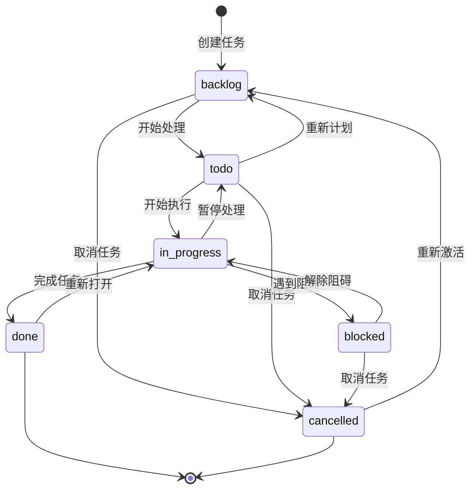
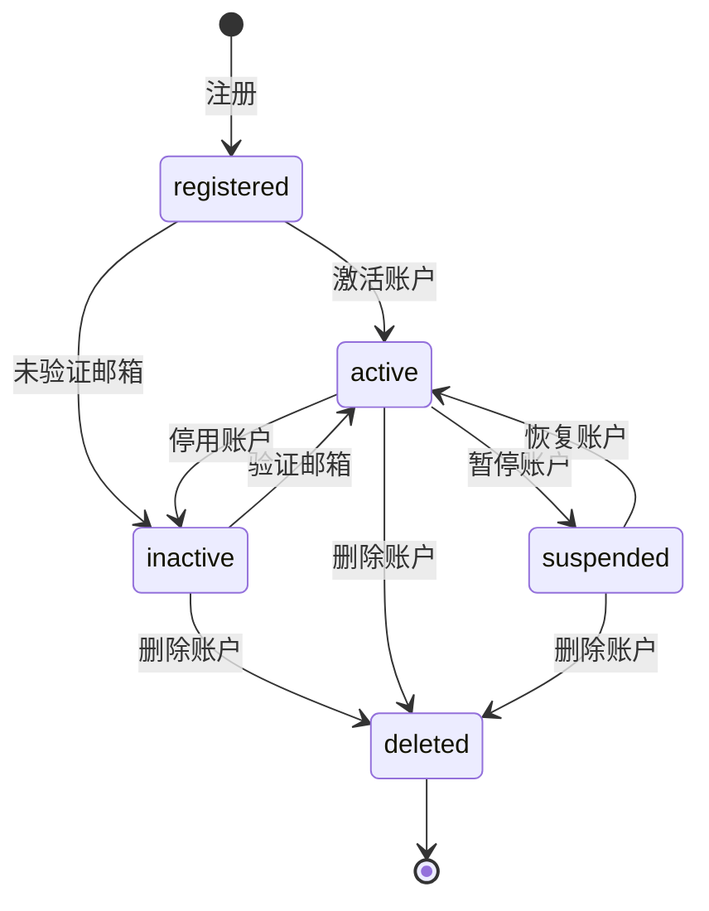

# 状态图

## 任务状态变化图

```mermaid
stateDiagram-v2
    [*] --> backlog: 创建任务
    
    backlog --> todo: 开始处理
    backlog --> cancelled: 取消任务
    
    todo --> in_progress: 开始执行
    todo --> backlog: 重新计划
    todo --> cancelled: 取消任务
    
    in_progress --> blocked: 遇到阻碍
    in_progress --> done: 完成任务
    in_progress --> todo: 暂停处理
    
    blocked --> in_progress: 解除阻碍
    blocked --> cancelled: 取消任务
    
    done --> in_progress: 重新打开
    done --> [*]
    
    cancelled --> backlog: 重新激活
    cancelled --> [*]
    
    %% 样式设置
    classDef base fill:#4A90E2,stroke:#FFFFFF,color:#FFFFFF;
    classDef active fill:#50E3C2,stroke:#000000,color:#000000;
    classDef inactive fill:#FF6F00,stroke:#FFFFFF,color:#FFFFFF;
    
    class backlog,base
    class todo,base
    class in_progress,active
    class blocked,inactive
    class done,active
    class cancelled,inactive
```

## 用户状态变化图

```mermaid
stateDiagram-v2
    [*] --> registered: 注册
    
    registered --> active: 激活账户
    registered --> inactive: 未验证邮箱
    
    inactive --> active: 验证邮箱
    inactive --> deleted: 删除账户
    
    active --> inactive: 停用账户
    active --> deleted: 删除账户
    active --> suspended: 暂停账户
    
    suspended --> active: 恢复账户
    suspended --> deleted: 删除账户
    
    deleted --> [*]
    
    %% 样式设置
    classDef base fill:#4A90E2,stroke:#FFFFFF,color:#FFFFFF;
    classDef active fill:#50E3C2,stroke:#000000,color:#000000;
    classDef inactive fill:#FF6F00,stroke:#FFFFFF,color:#FFFFFF;
    classDef final fill:#999999,stroke:#000000,color:#000000;
    
    class registered,base
    class active,active
    class inactive,inactive
    class suspended,inactive
    class deleted,final
```