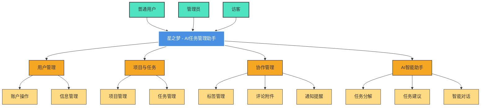

# 用例图

## 系统用例图（简化版）

```mermaid
graph TB
    A[星之梦 - AI任务管理助手] --> B[用户管理]
    A --> C[项目与任务]
    A --> D[协作管理]
    A --> E[AI智能助手]

    %% 用户角色
    U1[普通用户] --> A
    U2[管理员] --> A
    U3[访客] --> A

    %% 用户管理子功能
    B --> B1[账户操作]
    B --> B2[信息管理]

    %% 项目与任务子功能
    C --> C1[项目管理]
    C --> C2[任务管理]

    %% 协作管理子功能
    D --> D1[标签管理]
    D --> D2[评论附件]
    D --> D3[通知提醒]

    %% AI功能子功能
    E --> E1[任务分解]
    E --> E2[任务建议]
    E --> E3[智能对话]

    %% 上色
    style A fill:#4A90E2,stroke:#FFFFFF,stroke-width:2px,color:#FFFFFF
    style U1 fill:#50E3C2,stroke:#333,stroke-width:2px
    style U2 fill:#50E3C2,stroke:#333,stroke-width:2px
    style U3 fill:#50E3C2,stroke:#333,stroke-width:2px
    
    style B fill:#F5A623,stroke:#000000,stroke-width:1px
    style C fill:#F5A623,stroke:#000000,stroke-width:1px
    style D fill:#F5A623,stroke:#000000,stroke-width:1px
    style E fill:#F5A623,stroke:#000000,stroke-width:1px
    
    style B1 fill:#FFD166,stroke:#000000,stroke-width:1px,opacity:0.8
    style B2 fill:#FFD166,stroke:#000000,stroke-width:1px,opacity:0.8
    
    style C1 fill:#FFD166,stroke:#000000,stroke-width:1px,opacity:0.8
    style C2 fill:#FFD166,stroke:#000000,stroke-width:1px,opacity:0.8
    
    style D1 fill:#FFD166,stroke:#000000,stroke-width:1px,opacity:0.8
    style D2 fill:#FFD166,stroke:#000000,stroke-width:1px,opacity:0.8
    style D3 fill:#FFD166,stroke:#000000,stroke-width:1px,opacity:0.8
    
    style E1 fill:#FFD166,stroke:#000000,stroke-width:1px,opacity:0.8
    style E2 fill:#FFD166,stroke:#000000,stroke-width:1px,opacity:0.8
    style E3 fill:#FFD166,stroke:#000000,stroke-width:1px,opacity:0.8
```