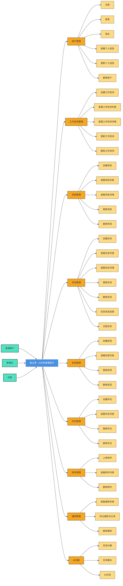

# 用例图

## 系统用例图

```mermaid
graph LR
    %% 用户角色
    U1[普通用户]
    U2[管理员]
    U3[访客]

    %% 主系统
    A[星之梦 - AI任务管理助手]

    %% 用户角色指向主系统
    U1 --> A
    U2 --> A
    U3 --> A

    %% 主要功能模块
    A --> B[用户管理]
    A --> C[工作空间管理]
    A --> D[项目管理]
    A --> E[任务管理]
    A --> F[标签管理]
    A --> G[评论管理]
    A --> H[附件管理]
    A --> I[通知管理]
    A --> J[AI功能]

    %% 用户管理子功能
    B --> B1[注册]
    B --> B2[登录]
    B --> B3[登出]
    B --> B4[查看个人信息]
    B --> B5[更新个人信息]
    B --> B6[删除账户]

    %% 工作空间管理子功能
    C --> C1[创建工作空间]
    C --> C2[查看工作空间列表]
    C --> C3[查看工作空间详情]
    C --> C4[更新工作空间]
    C --> C5[删除工作空间]

    %% 项目管理子功能
    D --> D1[创建项目]
    D --> D2[查看项目列表]
    D --> D3[查看项目详情]
    D --> D4[更新项目]
    D --> D5[删除项目]

    %% 任务管理子功能
    E --> E1[创建任务]
    E --> E2[查看任务列表]
    E --> E3[查看任务详情]
    E --> E4[更新任务]
    E --> E5[删除任务]
    E --> E6[任务状态变更]
    E --> E7[分配任务]

    %% 标签管理子功能
    F --> F1[创建标签]
    F --> F2[查看标签列表]
    F --> F3[更新标签]
    F --> F4[删除标签]

    %% 评论管理子功能
    G --> G1[创建评论]
    G --> G2[查看评论列表]
    G --> G3[更新评论]
    G --> G4[删除评论]

    %% 附件管理子功能
    H --> H1[上传附件]
    H --> H2[查看附件列表]
    H --> H3[删除附件]

    %% 通知管理子功能
    I --> I1[查看通知列表]
    I --> I2[标记通知为已读]
    I --> I3[删除通知]

    %% AI功能子功能
    J --> J1[任务分解]
    J --> J2[任务建议]
    J --> J3[AI对话]

    %% 样式设置保持不变
    style A fill:#4A90E2,stroke:#FFFFFF,stroke-width:2px,color:#FFFFFF
    style U1 fill:#50E3C2,stroke:#333,stroke-width:2px
    style U2 fill:#50E3C2,stroke:#333,stroke-width:2px
    style U3 fill:#50E3C2,stroke:#333,stroke-width:2px
    
    style B fill:#F5A623,stroke:#000000,stroke-width:1px
    style C fill:#F5A623,stroke:#000000,stroke-width:1px
    style D fill:#F5A623,stroke:#000000,stroke-width:1px
    style E fill:#F5A623,stroke:#000000,stroke-width:1px
    style F fill:#F5A623,stroke:#000000,stroke-width:1px
    style G fill:#F5A623,stroke:#000000,stroke-width:1px
    style H fill:#F5A623,stroke:#000000,stroke-width:1px
    style I fill:#F5A623,stroke:#000000,stroke-width:1px
    style J fill:#F5A623,stroke:#000000,stroke-width:1px
    
    %% 子功能节点样式
    style B1 fill:#FFD166,stroke:#000000,stroke-width:1px,opacity:0.8
    style B2 fill:#FFD166,stroke:#000000,stroke-width:1px,opacity:0.8
    style B3 fill:#FFD166,stroke:#000000,stroke-width:1px,opacity:0.8
    style B4 fill:#FFD166,stroke:#000000,stroke-width:1px,opacity:0.8
    style B5 fill:#FFD166,stroke:#000000,stroke-width:1px,opacity:0.8
    style B6 fill:#FFD166,stroke:#000000,stroke-width:1px,opacity:0.8
    
    style C1 fill:#FFD166,stroke:#000000,stroke-width:1px,opacity:0.8
    style C2 fill:#FFD166,stroke:#000000,stroke-width:1px,opacity:0.8
    style C3 fill:#FFD166,stroke:#000000,stroke-width:1px,opacity:0.8
    style C4 fill:#FFD166,stroke:#000000,stroke-width:1px,opacity:0.8
    style C5 fill:#FFD166,stroke:#000000,stroke-width:1px,opacity:0.8
    
    style D1 fill:#FFD166,stroke:#000000,stroke-width:1px,opacity:0.8
    style D2 fill:#FFD166,stroke:#000000,stroke-width:1px,opacity:0.8
    style D3 fill:#FFD166,stroke:#000000,stroke-width:1px,opacity:0.8
    style D4 fill:#FFD166,stroke:#000000,stroke-width:1px,opacity:0.8
    style D5 fill:#FFD166,stroke:#000000,stroke-width:1px,opacity:0.8
    
    style E1 fill:#FFD166,stroke:#000000,stroke-width:1px,opacity:0.8
    style E2 fill:#FFD166,stroke:#000000,stroke-width:1px,opacity:0.8
    style E3 fill:#FFD166,stroke:#000000,stroke-width:1px,opacity:0.8
    style E4 fill:#FFD166,stroke:#000000,stroke-width:1px,opacity:0.8
    style E5 fill:#FFD166,stroke:#000000,stroke-width:1px,opacity:0.8
    style E6 fill:#FFD166,stroke:#000000,stroke-width:1px,opacity:0.8
    style E7 fill:#FFD166,stroke:#000000,stroke-width:1px,opacity:0.8
    
    style F1 fill:#FFD166,stroke:#000000,stroke-width:1px,opacity:0.8
    style F2 fill:#FFD166,stroke:#000000,stroke-width:1px,opacity:0.8
    style F3 fill:#FFD166,stroke:#000000,stroke-width:1px,opacity:0.8
    style F4 fill:#FFD166,stroke:#000000,stroke-width:1px,opacity:0.8
    
    style G1 fill:#FFD166,stroke:#000000,stroke-width:1px,opacity:0.8
    style G2 fill:#FFD166,stroke:#000000,stroke-width:1px,opacity:0.8
    style G3 fill:#FFD166,stroke:#000000,stroke-width:1px,opacity:0.8
    style G4 fill:#FFD166,stroke:#000000,stroke-width:1px,opacity:0.8
    
    style H1 fill:#FFD166,stroke:#000000,stroke-width:1px,opacity:0.8
    style H2 fill:#FFD166,stroke:#000000,stroke-width:1px,opacity:0.8
    style H3 fill:#FFD166,stroke:#000000,stroke-width:1px,opacity:0.8
    
    style I1 fill:#FFD166,stroke:#000000,stroke-width:1px,opacity:0.8
    style I2 fill:#FFD166,stroke:#000000,stroke-width:1px,opacity:0.8
    style I3 fill:#FFD166,stroke:#000000,stroke-width:1px,opacity:0.8
    
    style J1 fill:#FFD166,stroke:#000000,stroke-width:1px,opacity:0.8
    style J2 fill:#FFD166,stroke:#000000,stroke-width:1px,opacity:0.8
    style J3 fill:#FFD166,stroke:#000000,stroke-width:1px,opacity:0.8
```