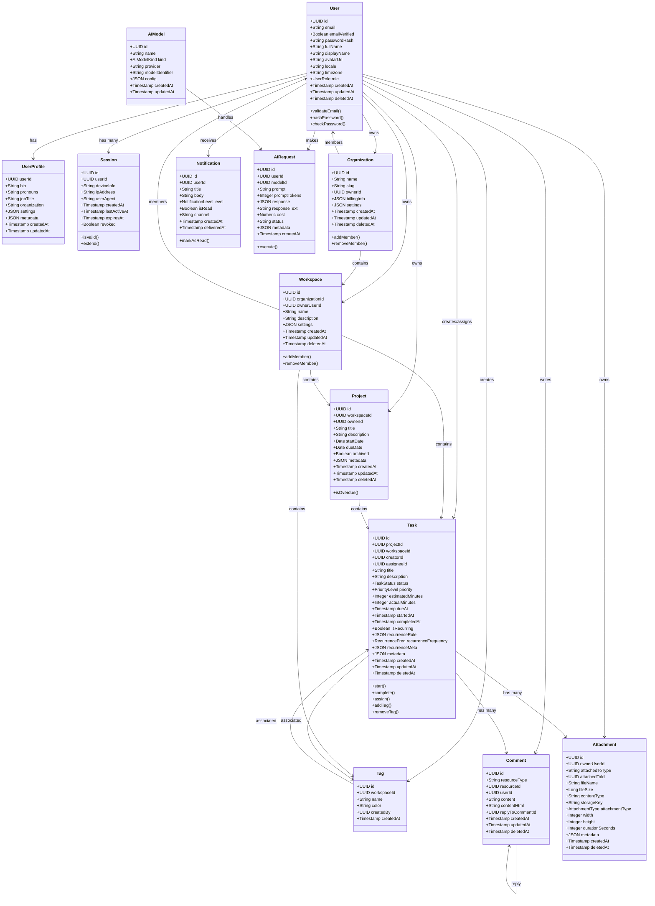

# 类图

## 系统类图

```mermaid
classDiagram
    %% 基础类定义
    class User {
        +UUID id
        +String email
        +Boolean emailVerified
        +String passwordHash
        +String fullName
        +String displayName
        +String avatarUrl
        +String locale
        +String timezone
        +UserRole role
        +Timestamp createdAt
        +Timestamp updatedAt
        +Timestamp deletedAt
        +validateEmail()
        +hashPassword()
        +checkPassword()
    }
    
    class UserProfile {
        +UUID userId
        +String bio
        +String pronouns
        +String jobTitle
        +String organization
        +JSON settings
        +JSON metadata
        +Timestamp createdAt
        +Timestamp updatedAt
    }
    
    class Session {
        +UUID id
        +UUID userId
        +String deviceInfo
        +String ipAddress
        +String userAgent
        +Timestamp createdAt
        +Timestamp lastActiveAt
        +Timestamp expiresAt
        +Boolean revoked
        +isValid()
        +extend()
    }
    
    class Organization {
        +UUID id
        +String name
        +String slug
        +UUID ownerId
        +JSON billingInfo
        +JSON settings
        +Timestamp createdAt
        +Timestamp updatedAt
        +Timestamp deletedAt
        +addMember()
        +removeMember()
    }
    
    class Workspace {
        +UUID id
        +UUID organizationId
        +UUID ownerUserId
        +String name
        +String description
        +JSON settings
        +Timestamp createdAt
        +Timestamp updatedAt
        +Timestamp deletedAt
        +addMember()
        +removeMember()
    }
    
    class Project {
        +UUID id
        +UUID workspaceId
        +UUID ownerId
        +String title
        +String description
        +Date startDate
        +Date dueDate
        +Boolean archived
        +JSON metadata
        +Timestamp createdAt
        +Timestamp updatedAt
        +Timestamp deletedAt
        +isOverdue()
    }
    
    class Task {
        +UUID id
        +UUID projectId
        +UUID workspaceId
        +UUID creatorId
        +UUID assigneeId
        +String title
        +String description
        +TaskStatus status
        +PriorityLevel priority
        +Integer estimatedMinutes
        +Integer actualMinutes
        +Timestamp dueAt
        +Timestamp startedAt
        +Timestamp completedAt
        +Boolean isRecurring
        +JSON recurrenceRule
        +RecurrenceFreq recurrenceFrequency
        +JSON recurrenceMeta
        +JSON metadata
        +Timestamp createdAt
        +Timestamp updatedAt
        +Timestamp deletedAt
        +start()
        +complete()
        +assign()
        +addTag()
        +removeTag()
    }
    
    class Tag {
        +UUID id
        +UUID workspaceId
        +String name
        +String color
        +UUID createdBy
        +Timestamp createdAt
    }
    
    class Comment {
        +UUID id
        +String resourceType
        +UUID resourceId
        +UUID userId
        +String content
        +String contentHtml
        +UUID replyToCommentId
        +Timestamp createdAt
        +Timestamp updatedAt
        +Timestamp deletedAt
    }
    
    class Attachment {
        +UUID id
        +UUID ownerUserId
        +String attachedToType
        +UUID attachedToId
        +String fileName
        +Long fileSize
        +String contentType
        +String storageKey
        +AttachmentType attachmentType
        +Integer width
        +Integer height
        +Integer durationSeconds
        +JSON metadata
        +Timestamp createdAt
        +Timestamp deletedAt
    }
    
    class Notification {
        +UUID id
        +UUID userId
        +String title
        +String body
        +NotificationLevel level
        +Boolean isRead
        +String channel
        +Timestamp createdAt
        +Timestamp deliveredAt
        +markAsRead()
    }
    
    class AIModel {
        +UUID id
        +String name
        +AIModelKind kind
        +String provider
        +String modelIdentifier
        +JSON config
        +Timestamp createdAt
        +Timestamp updatedAt
    }
    
    class AIRequest {
        +UUID id
        +UUID userId
        +UUID modelId
        +String prompt
        +Integer promptTokens
        +JSON response
        +String responseText
        +Numeric cost
        +String status
        +JSON metadata
        +Timestamp createdAt
        +execute()
    }
    
    %% 类之间的关系
    User --> UserProfile : has
    User --> Session : has many
    User --> Organization : owns
    User --> Workspace : owns
    User --> Project : owns
    User --> Task : creates/assigns
    User --> Tag : creates
    User --> Comment : writes
    User --> Attachment : owns
    User --> AIRequest : makes
    User --> Notification : receives
    
    Organization --> Workspace : contains
    Organization --> User : members
    
    Workspace --> Project : contains
    Workspace --> Task : contains
    Workspace --> Tag : contains
    Workspace --> User : members
    
    Project --> Task : contains
    
    Task --> Comment : has many
    Task --> Attachment : has many
    Task --> Tag : associated
    
    Tag --> Task : associated
    
    Comment --> Comment : reply
    
    AIModel --> AIRequest : handles
```