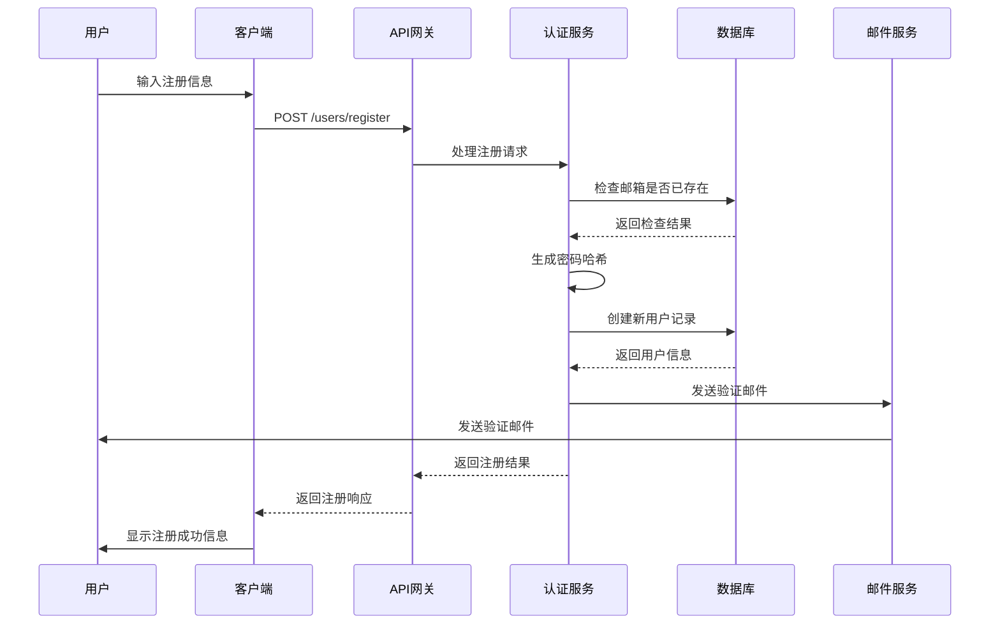
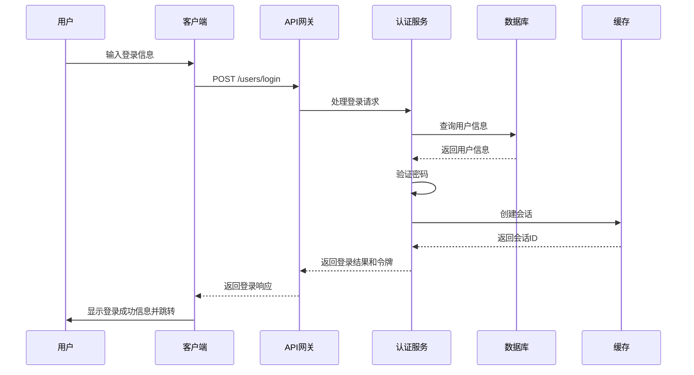
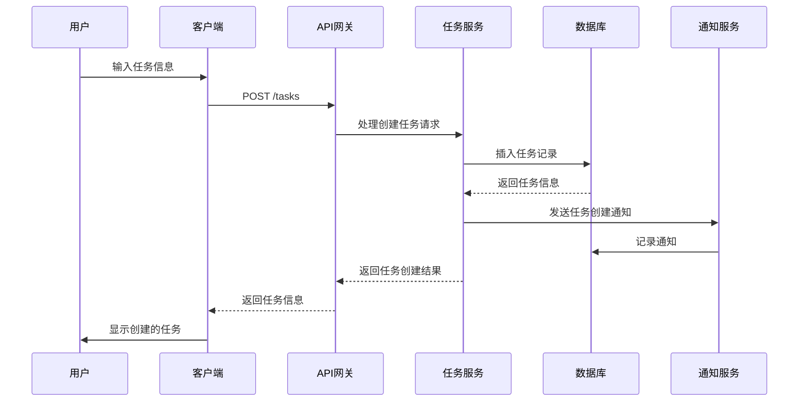
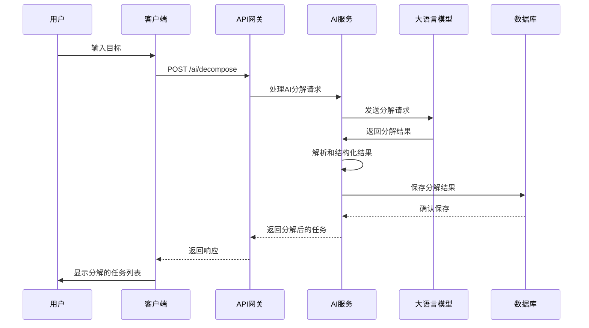

# 顺序图

## 用户注册流程顺序图

```mermaid
sequenceDiagram
    participant U as 用户
    participant C as 客户端
    participant API as API网关
    participant Auth as 认证服务
    participant DB as 数据库
    participant Email as 邮件服务
    
    U->>C: 输入注册信息
    C->>API: POST /users/register
    API->>Auth: 处理注册请求
    Auth->>DB: 检查邮箱是否已存在
    DB-->>Auth: 返回检查结果
    Auth->>Auth: 生成密码哈希
    Auth->>DB: 创建新用户记录
    DB-->>Auth: 返回用户信息
    Auth->>Email: 发送验证邮件
    Email->>U: 发送验证邮件
    Auth-->>API: 返回注册结果
    API-->>C: 返回注册响应
    C->>U: 显示注册成功信息
```

## 用户登录流程顺序图

```mermaid
sequenceDiagram
    participant U as 用户
    participant C as 客户端
    participant API as API网关
    participant Auth as 认证服务
    participant DB as 数据库
    participant Cache as 缓存
    
    U->>C: 输入登录信息
    C->>API: POST /users/login
    API->>Auth: 处理登录请求
    Auth->>DB: 查询用户信息
    DB-->>Auth: 返回用户信息
    Auth->>Auth: 验证密码
    Auth->>Cache: 创建会话
    Cache-->>Auth: 返回会话ID
    Auth-->>API: 返回登录结果和令牌
    API-->>C: 返回登录响应
    C->>U: 显示登录成功信息并跳转
```

## 创建任务流程顺序图

```mermaid
sequenceDiagram
    participant U as 用户
    participant C as 客户端
    participant API as API网关
    participant Task as 任务服务
    participant DB as 数据库
    participant Notify as 通知服务
    
    U->>C: 输入任务信息
    C->>API: POST /tasks
    API->>Task: 处理创建任务请求
    Task->>DB: 插入任务记录
    DB-->>Task: 返回任务信息
    Task->>Notify: 发送任务创建通知
    Notify->>DB: 记录通知
    Task-->>API: 返回任务创建结果
    API-->>C: 返回任务信息
    C->>U: 显示创建的任务
```

## AI任务分解流程顺序图

```mermaid
sequenceDiagram
    participant U as 用户
    participant C as 客户端
    participant API as API网关
    participant AI as AI服务
    participant LLM as 大语言模型
    participant DB as 数据库
    
    U->>C: 输入目标
    C->>API: POST /ai/decompose
    API->>AI: 处理AI分解请求
    AI->>LLM: 发送分解请求
    LLM->>AI: 返回分解结果
    AI->>AI: 解析和结构化结果
    AI->>DB: 保存分解结果
    DB-->>AI: 确认保存
    AI-->>API: 返回分解后的任务
    API-->>C: 返回响应
    C->>U: 显示分解的任务列表
```